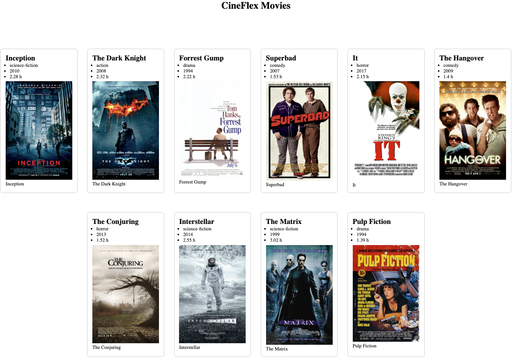

# 🏠 JavaScript DOM Data Rendering #1  
## Datastruktur og visning i DOM  
### CineMaxx Movies

## Opgavebeskrivelse

Du skal bygge en lille movie-side, hvor filmdata fra JavaScript bliver vist i DOM’en.

Du arbejder både med:

- JavaScript datastruktur (**array med objekter**)
- DOM-manipulation
- funktioner
- forEach()
- querySelector()
- innerHTML
- template literals
- CSS Flexbox

Formålet med opgaven er at koble **data og visning i DOM’en** sammen og samtidig style siden, så den ligner layoutet fra undervisningen.

---

## Forudsætninger

Du må redigere i:

- `js/script.js`
- `css/style.css`

I `index.html` skal du kun:

- linke til `css/style.css`
- linke til `js/script.js`


---

## Trin-for-trin

1. Download projektkoden (ZIP-fil) fra GitHub, og udpak den på din computer.

2. Opret et nyt repository på GitHub.com med et passende navn, fx:

`dom-data-rendering-exercise` (kun små bogstaver og bindestreg)

3. Kopiér linket til dit GitHub-repository.

4. Åbn GitHub Desktop og vælg **Clone repository**.

5. Vælg fanen **URL**, indsæt linket, og vælg en passende placering under **Local Path**.

6. Kopiér indholdet fra den udpakkede projektmappe over i den klonede mappe.

7. Åbn projektmappen i Visual Studio Code.

8. Løs nu opgaverne herunder.

---

## Projektmappe

Du får udleveret en projektmappe, som indeholder:

- en `index.html` fil
- en `css`-mappe
- en `js`-mappe
- en `img`-mappe med billeder
- en `movies.txt` indeholdende yderligere detaljer om de enkelte film

Du skal selv:

- linke `css/style.css` i `index.html`
- linke `js/script.js` i `index.html`

Du skal **ikke** ændre HTML-strukturen i `index.html`.

---

### Opgave 1 – Link til CSS og JavaScript

I `index.html` skal du indsætte:

- et `<link>`-tag til `css/style.css`
- et `<script>`-tag til `js/script.js`

CSS skal linkes i `<head>`, og JavaScript skal linkes lige før `</body>`.

---

### Opgave 2 – Tilføj Strict Mode

Åbn `js/script.js`.

Tilføj denne linje som det allerførste i filen:

```js
"use strict";
```

---

### Opgave 3 – Opret datastrukturen movies med de første 5 film

Åbn filen movies.txt.

I `js/movies-script.js` skal du nu:

- Opret en konstant variabel med navnet `movies`
- Få variablen `movies` til at pege på arrayet med objekter
- Brug oplysningerne fra **movies.txt**
- Vælg passende datatyper tol de forskellige properties
- Opret kun de første 5 film i arrayet

Hvert objekt skal have følgende properties:

- id
- title
- genre
- year
- duration
- img
- url

Du skal altså oprette de første 5 film i **movies.txt** og skrive dem ind i din JavaScript-datastruktur.
---

### Opgave 4 – Opret variablen moviesContainer

- Opret en konstant variabel med navnet - **moviesContainer**
- Variablen skal pege på elementet med id - **movies-container** 

*Hint: Brug `document.querySelector()`.*

---

### Opgave 5 – Opret funktionen displayMovies(movieList)

- Opret en funktion med navnet - **displayMovies**
- Funktionen skal have en parameter med navnet - **movieList**
- Funktionen skal bruges til at vise filmene på siden.

---

### Opgave 6 – Tøm containeren før filmene vises

Inde i funktionen **displayMovies(movieList)** skal du først tømme containeren.

*Brug:*

```JavaScript
moviesContainer.innerHTML = "";
```

--- 

### Opgave 7 – Brug `forEach()` til at gennemløbe filmene

Inde i funktionen **displayMovies(movieList)** skal du bruge `forEach()` til at gennemløbe alle film i arrayet.

---

### Opgave 8 – Vis film med `innerHTML`

Inde i din `forEach()` skal du tilføje HTML til `moviesContainer.innerHTML`.

Du skal bruge:

- `innerHTML`
- `+=`
- `${}` til at indsætte data fra hvert film-objekt

For hver film skal du mindst vise:

- titel
- genre
- år
- varighed

Din kode inde i `forEach()` skal benytte nedenstående HTML-struktur til at vise data fra `movie`, f.eks.:

```javascript
moviesContainer.innerHTML += `
  <article>
    <h2>titel</h2>
    <p>Genre</p>
    <p>År</p>
    <p>Varighed</p>
  </article>
  <figure>
  <!-- Skal benyttes i opgave 9 -->
  </figure>
`;
```


Erstat placeholder teksten foroven med data fra JS-datastruktur f.eks. så kan `titel` erstattes med f.eks. `${movie.title}` osv.

---

### Opgave 9 – Tilføj billede og link

Udvid din HTML (fra forrige opgave) inde i displayMovies().

Hver film skal også vise:

- et billede med img // 'hint: figure-tag
- et link med a
- et alt-attribut på billedet
- en figcaption

Du skal benytte nedenstående HTML-struktur med `figure` og `figcaption`.

Erstat alle de steder i HTML-strukturen for oven hvor der står noget med **placeholder**  med data fra JS-datastruktur f.eks placeholder-url bliver til `${movie.url}`

```HTML
<figure>
  <a href="placeholder-url" target="_blank" rel="noopener noreferrer"></a>
  <figcaption>placehlder-titel</figcaption>
</figure>
```
---

### Opgave 10 – Kald funktionen med filmdata

Nu skal du kalde funktionen `displayMovies()` og sende din JS-datastruktur med filmdata ind som et argument.

--- 

### Opgave 11 – Tilføj de øvrige film fra movies.txt filen

Åbn filen movies.txt igen.

Du har allerede oprettet de første 5 film i din JavaScript-datastruktur.

Nu skal du udvide din eksisterende variabel movies, så den også indeholder alle film fra movies.txt.

Det betyder, at dit array til sidst skal indeholder alle filmobjekter.

---

### Opgave 12 – Grundlæggende CSS styling

Style siden i `css/style.css`.

Siden skal mindst have:

- en centreret overskrift
- luft omkring indholdet
- filmkort med kant eller baggrund
- ensartet afstand mellem elementer
- billeder i en passende størrelse

Du skal forsøge at style siden, så den minder så meget som muligt om referencebilledet, som vises efter opgave 13.

Du må gerne bruge følgende CSS properties:

- margin
- padding
- border
- border-radius
- width
- height
- max-width

---

### Opgave 13 – Layout med CSS Flexbox

Brug CSS Flexbox til at lave layoutet til filmene, så siden ligner referencebilledet så meget som muligt.

Filmene skal vises som kort i rækker med luft imellem.

Du skal bruge Flexbox på **#movies-container.**

Her er nogle egenskaber, du kan arbejde med:

- display: flex;
- flex-wrap: wrap;
- justify-content
- align-items
- gap


---

## 📚 Ressourcer og hjælp

- W3Schools – JavaScript Arrays
  https://www.w3schools.com/js/js_arrays.asp

- W3Schools – JavaScript Objects
  https://www.w3schools.com/js/js_objects.asp

- W3Schools – JavaScript Functions
  https://www.w3schools.com/js/js_functions.asp

- W3Schools – JavaScript forEach()
  https://www.w3schools.com/jsref/jsref_foreach.asp

- W3Schools – JavaScript HTML DOM
  https://www.w3schools.com/js/js_htmldom.asp

- W3Schools – querySelector()
  https://www.w3schools.com/jsref/met_document_queryselector.asp

- W3Schools – innerHTML
  https://www.w3schools.com/jsref/prop_html_innerhtml.asp

- W3Schools – Template literals
  https://www.w3schools.com/js/js_string_templates.asp

- W3Schools – CSS Flexbox
  https://www.w3schools.com/css/css3_flexbox.asp

## 📤 Aflevering

Indsæt linket (URL) til dit GitHub-repository på Canvas.

Sørg for, at repository’et er public.

## ⏰ Afleveringsfrist

Torsdag d. 16. april 2026 kl. 23.59 på Canvas.

